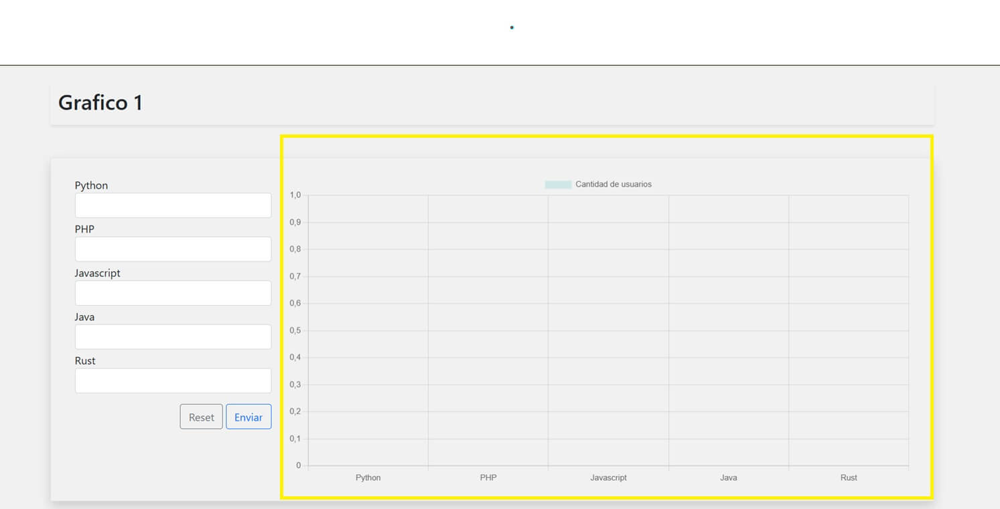
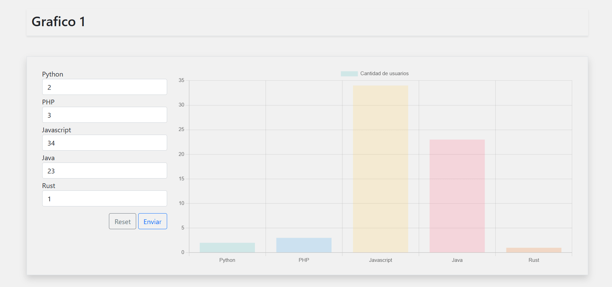

# Tarea 05

## Graficas
Tareas a realizar:
> `GRÁFICO 1` -> En el eje X considerar el nombre de 5 lenguajes de programación, construir además 5 cajas de texto que suministrarán los valores al eje Y

> `GRÁFICO 2` -> En el eje X considerar los días de la semana, luego, guardar en un archivo JSON los datos para el eje Y. La aplicación deberá leer los datos y cargarlos en gráfico.

### Grafica 1
Al entrar en la pagina al lado derecho se mostrara una grafica con valores vacios en la seccion (y).

Del lado izquierdo podemos encontrar un pequeño formulario que podemos usar para interactuar con los valores de la grafica

### Grafica 2

## API decolecta

### RENIEC

### RUC
